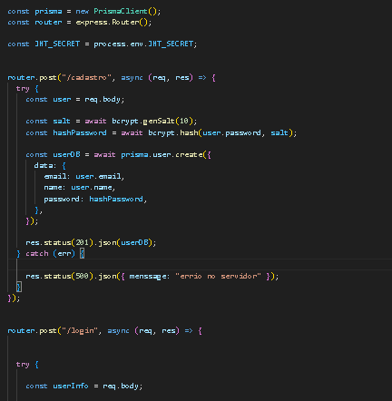
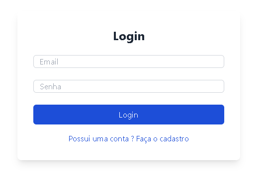
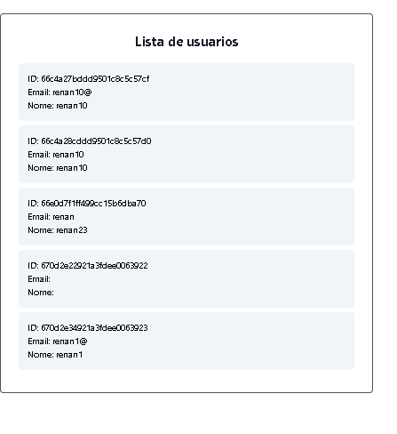

# Sistema de Autenticação e Listagem de Usuários

Este projeto é uma aplicação full-stack que implementa um sistema de cadastro, login e listagem de usuários. Ele foi desenvolvido utilizando **React** no front-end e **Express.js** no back-end, com autenticação via JWT e persistência de dados através de **Prisma**.

## Funcionalidades

- **Cadastro de Usuários**: Usuários podem se cadastrar informando nome, email e senha.
- **Login**: Usuários podem fazer login, receber um token JWT e acessar rotas protegidas.
- **Listagem de Usuários**: Após o login, os usuários autenticados podem visualizar a lista de usuários cadastrados.

## Tecnologias Utilizadas

### Front-End
- **React**: Utilizado para construir a interface do usuário.
- **Axios**: Para comunicação com o back-end (API).
- **React Router**: Para gerenciamento de rotas no front-end.
- **Hooks**: `useState`, `useEffect`, `useRef`, `useNavigate` para gerenciar estado e navegação.

### Back-End
- **Express.js**: Framework para o desenvolvimento do servidor e rotas.
- **Prisma**: ORM para manipulação de dados no banco de dados.
- **JWT**: Autenticação com tokens para proteger rotas sensíveis.
- **CORS** e **express.json()**: Para comunicação e troca de dados entre o front e back-end.

## Imagens

### Rotas do Back-End (Express.js)
As rotas da aplicação foram configuradas utilizando o **Express.js**, que lida com a autenticação e operações no banco de dados.



### Front-End: Login
A tela de login permite que os usuários insiram suas credenciais e acessem o sistema.



### Listagem de Usuários
Após fazer login, o usuário é redirecionado para uma tela que exibe todos os usuários cadastrados, acessível somente para usuários autenticados.



## Instalação

1. **Clone o repositório**:
   ```bash
  
